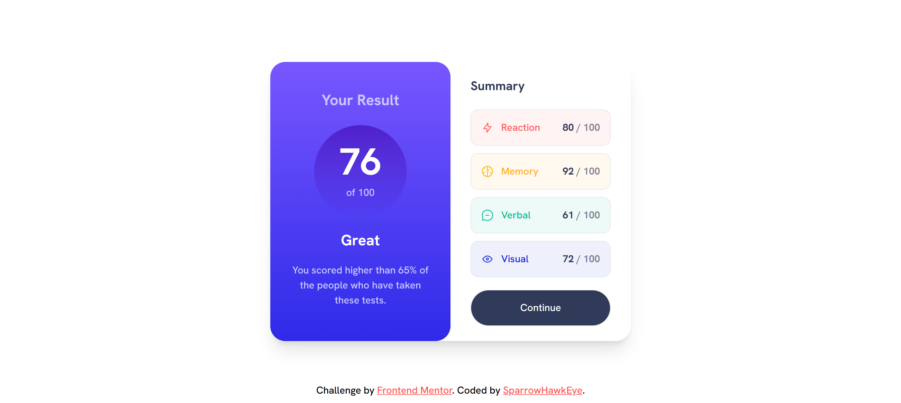
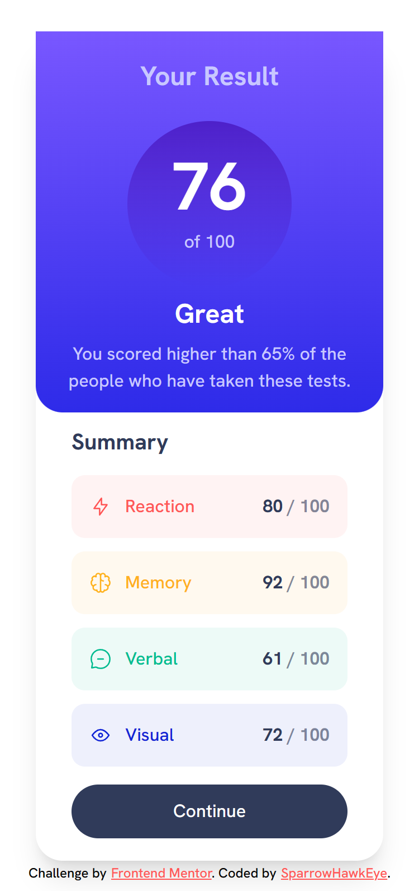

# Frontend Mentor - Results summary component solution

This is a solution to the [Results summary component challenge on Frontend Mentor](https://www.frontendmentor.io/challenges/results-summary-component-CE_K6s0maV). Frontend Mentor challenges help you improve your coding skills by building realistic projects.

## Table of contents

- [Frontend Mentor - Results summary component solution](#frontend-mentor---results-summary-component-solution)
  - [Table of contents](#table-of-contents)
  - [Overview](#overview)
    - [The challenge](#the-challenge)
    - [Screenshot](#screenshot)
    - [Links](#links)
  - [My process](#my-process)
    - [Built with](#built-with)
    - [What I learned](#what-i-learned)
    - [Useful resources](#useful-resources)
  - [Author](#author)

## Overview

### The challenge

Users should be able to:

- View the optimal layout for the interface depending on their device's screen size
- See hover and focus states for all interactive elements on the page

### Screenshot

- Desktop View: 
- Mobile View: 

### Links

- [Solution URL](https://github.com/SparrowHawkEye/FM_ResultSummaryComponent)
- [Live Site URL](https://fmresultsummarycomponent.netlify.app/)
-

## My process

### Built with

- Semantic HTML5 markup
- CSS custom properties
- Flexbox
- Mobile-first workflow
- Vite
- [React](https://reactjs.org/) - JS library
- [Tailwind CSS](https://tailwindcss.com/) - CSS framework

**Note: These are just examples. Delete this note and replace the list above with your own choices**

### What I learned

- Customizing tailwindCSS color
- Dynamic tailwindCSS className

### Useful resources

- [Dynamic tailwindCSS className ](https://tailwindcss.com/docs/content-configuration#dynamic-class-names) - This helped me for XYZ reason. I really liked this pattern and will use it going forward.

## Author

- Website - [SparrowHawkEye](https://sparrowhawkeye-dev.web.app/)
- Frontend Mentor - [@SparrowHawkEye](https://www.frontendmentor.io/profile/SparrowHawkEye)
- Twitter - [@SparrowHawk_Eye](https://twitter.com/SparrowHawk_Eye)
